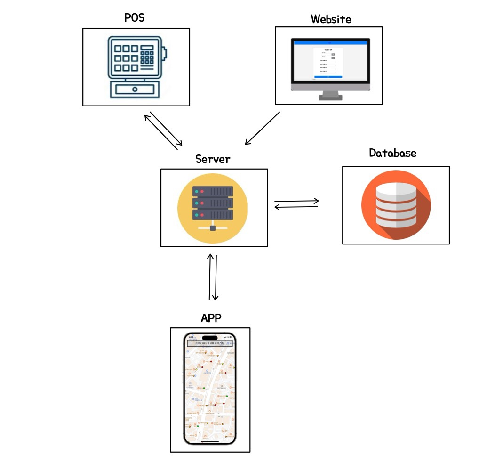

# 🍽️ Real-Time Restaurant Reservation & Congestion Level App

A full-stack system that allows users to check how crowded a restaurant is in real time, make reservations, and order food via a mobile app. All congestion data is synced with a virtual POS system and updated through a Node.js server.

---

## 📌 Features

### 📦 Crowding Level Logic
crowding = occupied_tables / total_tables
0–50%     → Green  
50–75%    → Yellow  
75–100%   → Orange  
100%+     → Red (Waiting)

### 👤 For Users
- Real-time restaurant crowd levels shown on a map (Google Maps API)
- Color-coded congestion:
  - 🟩 Green: 0–50%
  - 🟨 Yellow: 50–75%
  - 🟧 Orange: 75–100%
  - 🟥 Red: 100%+ (waiting)
- View restaurant info, available tables, and menu
- Make a reservation and receive confirmation in the app
- Manual "Update" button to fetch real-time congestion

### 🧾 For Restaurant Staff (POS App)
- Flutter-based virtual POS system (iOS)
- View and manage table occupancy
- Place orders, process payments
- Receive in-app user orders and Accept/Decline them

### 🧑‍💻 For Restaurant Owners (Web Admin)
- Register restaurant info (name, address, table types)
- Data sent to server and stored in MySQL

---

## 🧩 Architecture Overview

---

## 🛠 Tech Stack

| Area        | Tech                                   |
|-------------|----------------------------------------|
| Frontend    | Flutter (User App & POS), HTML/CSS/JS |
| Backend     | Node.js (Express)                     |
| Database    | MySQL                                  |
| Platform    | iOS (macOS dev)                        |
| Map API     | Google Maps API                        |

---

## 📽 Demo Videos

### 1️⃣ Registering a Restaurant via Admin Website
👉 [📺 Click here to watch the demo](https://github.com/zpdl768/restaurant-project/issues/1)  
> Demonstrates how a restaurant owner registers their restaurant via the admin website and how the data is stored in the MySQL database.

---

### 2️⃣ Real-Time Crowd Sync Between POS and User App
👉 [📺 Click here to watch the demo](https://github.com/user-attachments/assets/fccff311-fba6-43ad-8df6-924420c3b5c2)  
> Shows how table occupancy changes in the POS system are synced in real time to the user app, with crowd levels reflected as color-coded markers on the map.

---

### 3️⃣ Sending Orders from User App and Responding via POS
👉 [📺 Click here to watch the demo](https://github.com/user-attachments/assets/92f16d1c-859c-4028-aaef-83c567a4d040)  
> Demonstrates how a user selects a restaurant, places an order through the app, and how the restaurant receives and responds to the order via the POS system.

---

## 🧑‍🎓 Developer

**YeoMyeong Kim**

- Planned, designed, and implemented all components  
- Integrated system end-to-end across mobile, web, and server  
- Wrote all documentation and managed demo

